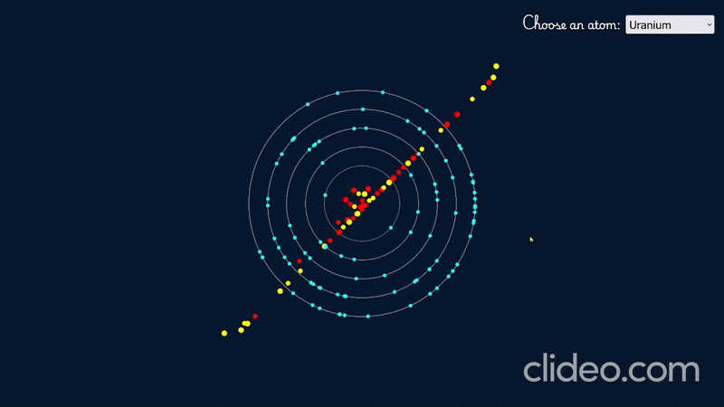

# Atom Simulation

This project is an interactive atom simulation built with HTML, CSS, and JavaScript. Users can select different atoms, and the simulation dynamically visualizes their structure, including protons, neutrons, and electrons with animated orbits.

## Demo



> *The above GIF showcases the atom simulation with dynamic animations and user interaction.*

## Features

- **Dynamic Atom Selection**: Choose from a wide range of elements on the periodic table.
- **Realistic Visualization**: Simulates the nucleus (protons and neutrons) and electron shells with accurate electron configurations.
- **Interactive Animation**: Electrons orbit dynamically, and nucleus particles move slightly for a lively effect.
- **Custom Styling**: Modern and minimalistic design with a dark theme for optimal visualization.

## Technologies Used

- **HTML5**: Markup structure and `<canvas>` element for rendering the atom visualization.
- **CSS3**: Styling, including responsive design and custom fonts.
- **JavaScript**: Logic for particle creation, animation, and interaction handling.

## How to Use

1. Clone this repository:
   ```bash
   git clone https://github.com/Neo-Ayush-jha/Planet.git